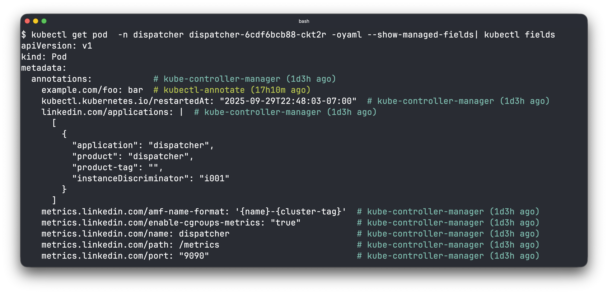
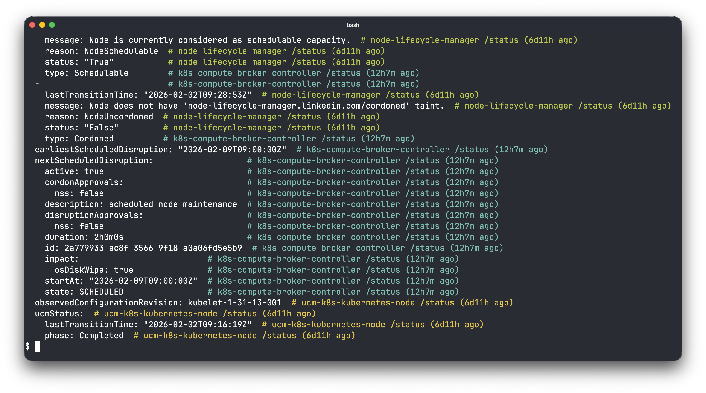

# kubectl-fields

`kubectl-fields` is a `kubectl` plugin that annotates Kubernetes YAML object
outputs with the manager of each field.

This helps you understand which controller is managing which part of your
Kubernetes objects, and understand effects of server-side apply.

## Usage

Pipe the output of `kubectl get -o yaml --show-managed-fields` to `kubectl-fields`:

```sh
kubectl get deploy/my-app -o yaml --show-managed-fields | kubectl fields
```

### Example Output

[](./img/screenshot-1.png)
[](./img/screenshot-2.png)

## Installation

For now, get this tool via:

```
go install github.com/ahmetb/kubectl-fields/cmd/kubectl-fields@latest
```

and ensure your GOBIN directory (typically ~/go/bin) is in your `$PATH`.

## Features

- Display separate color for each field manager.
- Can handle multiple YAML documents or `List` results from kubectl output.
- Use `--above` to add annotations above the fields instead of inline
- Vertical alignment of YAML comments (the tool still generates valid YAML output)
- Use `--mtime=relative|absolute|hide` to show when the field was edited
- Use `--show-operation` to also display if it was a `Patch` or `Apply` operation.

## Development

Use [GSD](https://github.com/glittercowboy/get-shit-done) to develop this
project and have it reuse existing context/design docs checked into the repo.
